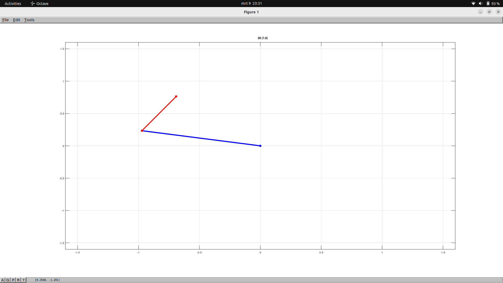

# double_pendulum_octave
Swinging double pendulum in Octave (open source version of Matlab). 

Octave can be installed on Linux via `sudo apt install octave`.

In the unpacked directory just run `dp` in Octave to start the simulation.

It will plot the double pendulum, which starts swinging after 3 seconds.

The program will first calculate for 2 seconds the time delay necessary to make the pendulum swing in realtime.

On Linux you end the program by typing crtl c.

It uses fourth order Runge-Kutta on the solution of the Hamilton-Lagrange equations.

Parameters can easily be changed at the top of dp.m.

It's fun to set both `TH10` and `TH20` to 180 degrees.
This gives a vertical double pendulum which should be stable in theory but in practice begins to fall after about a minute due to the finite accuracy of the simulation.

